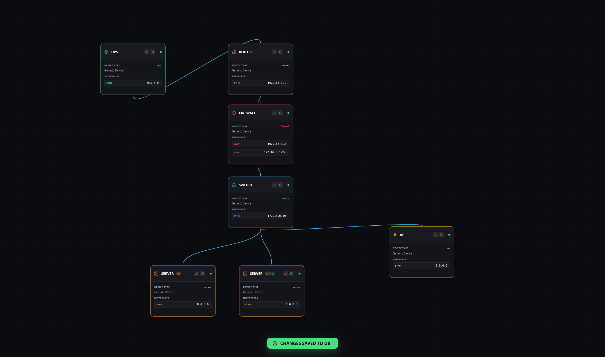

# ⚡ SparkCanvas: The Ultimate Homelab Architect ⚡


> Elevate your network documentation from boring spreadsheets to a high-tech, interactive digital twin. 🚀

**SparkCanvas** is a professional-grade, open-source network mapping tool designed specifically for homelab enthusiasts and network engineers. Stop guessing where your cables go and start visualizing your infrastructure with a "Cyber-Tech" aesthetic inspired by modern SOC dashboards.



---

## 🚀 Quick Start (One Command)

```bash
git clone https://github.com/privatefound/SparkCanvas.git && cd SparkCanvas && chmod +x install.sh && ./install.sh
```

L'app sarà disponibile all'indirizzo: `http://localhost:3001`

---

## ✨ Key Features

### 🛠️ Interactive Network Builder
*   **Drag & Drop Library**: Instantly deploy Firewalls, Routers, Switches, Servers, NAS, IoT, APs, and UPS nodes.
*   **Services System**: Drag common homelab services (Pi-hole, Netdata, Grafana, etc.) directly onto your servers to assign them. 🐳
*   **Custom Node Engine**: Create unique devices with a library of tech icons and full RGB color control. 🎨
*   **Malleable Connections**: No more rigid lines. Enjoy smooth, animated Bezier curves that simulate real-time data flow. 🌊

### 🔌 Smart Integration
*   **phpIPAM Intelligent Import**: Drop your `.xls` or `.xlsx` export and watch SparkCanvas build your network draft automatically using advanced heuristics. 🤖
*   **SQLite Persistence**: Your data is stored locally and securely in a private database.

---

## 🛠️ Built With
*   [React 19](https://react.dev/) - The engine
*   [SQLite3](https://github.com/sqlite/sqlite3) - Local data persistence
*   [@xyflow/react](https://reactflow.dev/) - The canvas
*   [Lucide-React](https://lucide.dev/) - The icons

---

## 🤝 Contributing
Created by **privatefound**.

## 📜 License
Licensed under the MIT License. Built with 💻 and ☕ for the Homelab community.

---